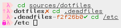

# λ-17



## Installation

### Via zgen:

```
zgen load seletskiy/zsh-prompt-lambda17
```

## Usage

Set up theme with command:

```
prompt -s lambda17
```

Prompt is highly extensible, consult help:

```
prompt -h lambda17
```
